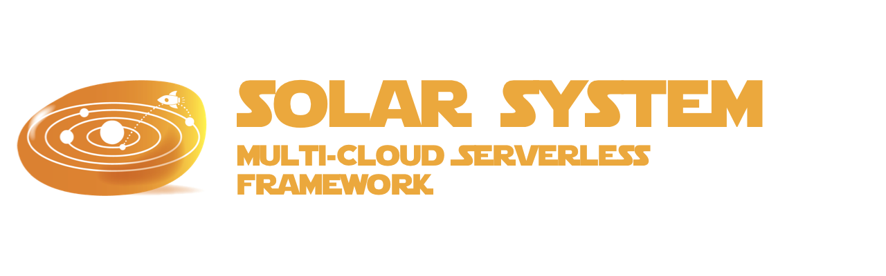

# solarsystem



> **THIS PROJECT IS STILL IN THE DESIGN PHASE**
>
> IDEAS & CONTRIBUTIONS ARE WELCOME
>
> An [Open Source Universe](https://github.com/intellibus/approach) Project

---

## Contents

- [solarsystem](#solarsystem)
  - [Contents](#contents)
  - [Features ✨](#features-)
  - [Install 🛠](#install-)
  - [Usage 🔭](#usage-)
  - [Documentation 🛰](#documentation-)
  - [Contributing 🌎](#contributing-)
  - [License ⚖️](#license-️)

## Features ✨

- Deploy to Multiple Clouds Active-Active `Planned`
- Deploy to Multiple-Clouds for DR `Planned`
- Canary Releases `Planned`
- Blue Green Deployments `Planned`
- Custom Adapters for any Cloud `Planned`
- Custom Adapters for any IaC Tool `Planned`
- Typescript Support `Planned`

## Install 🛠

```sh
npm install -g @intellibus/solarsystem
```

## Usage 🔭

Read more about the [Design](https://github.com/intellibus/solarsystem/blob/main/DESIGN.md) behind `solarsystem` here.

```typescript
/**
 * @solarsystem Input: API Gateway
 * @solarsystem Output: API Gateway Response
 * @solarsystem On Error Log: Alert L3
 * @solarsystem Clouds: AWS, GCP
 * @solarsystem Deployment Model: Disaster Recovery
 * @solarsystem Regions: us-east-1, eu-west-2, ap-east-1
 * @solarsystem Projected Volume: 1000 Requests / Second
 * @solarsystem Projected Peak: 1500 Requests / Second
*/
const createUser = (userData) => {
  const { data, error } = await x(updateDatabase, userData)
  if (error) {
    log.error(error);
    return new Error('User Creation Failed');
  }
  log.info('Added New User to Database');
  return { data }
}
```

```sh
$ solarsystem deploy

Deploying your function to AWS...
Deploying your API Gateway to AWS...
Configuring Permissions in AWS...
Deploying your function to GCP...
Deploying your API Gateway to GCP...
Configuring Permissions in GCP...
Setting Up AWS as Primary Cloud...
Setting Up us-east-1 (AWS) as Primary Region...
Setting Up us-east-1 (GCP) as Primary DR...
Congrats! Your Application has been deployed!
```

## Documentation 🛰

`solarsystem` *is under active development, documentation will be added once an initial release is ready.*

## Contributing 🌎

We would love for you to contribute your ideas, code, & fixes to `solarsystem`.

We encourage everyone to read our [Design Document](https://github.com/intellibus/solarsystem/blob/main/DESIGN.md) to learn more about the thought process behind solarsystem.

Also check out the [rewards](https://github.com/intellibus/approach/blob/main/REWARDS.md) offered for contributing to the [Open Source Universe](https://github.com/intellibus/approach).

## License ⚖️

MIT
